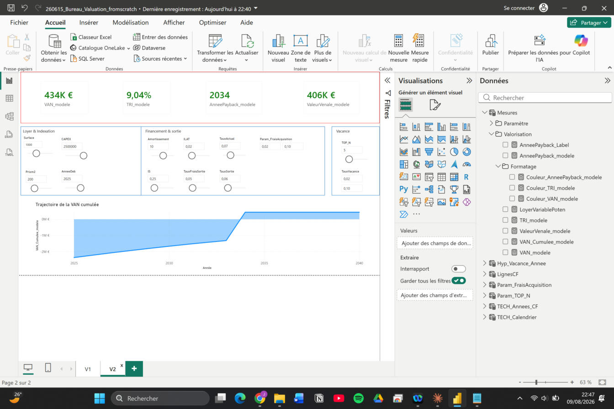

# Office Valuation Engine

Moteur de valorisation DCF (Discounted Cash Flow) pour actifs de bureaux, construit en DAX sur Power BI — sliders interactifs, hypothèses paramétrées, sortie VAN / TRI / Valeur vénale en temps réel.

Ce projet transpose un modèle Excel de valorisation immobilière en architecture Power BI entièrement paramétrique, sur le même principe qu'un moteur de valorisation parking que j'avais construit auparavant : `LoyerBase × ILAT × occupation → NOI → VAN → TRI`. L'objectif : un seul moteur de cash-flow réutilisable, où les hypothèses (loyers, vacance, taux, frais) sont pilotées par sliders plutôt que codées en dur — pas un classeur Excel figé pour un actif donné.

> **Données** : le jeu de données utilisé ici est entièrement fictif ("Immeuble de bureaux fictif — Île-de-France"). Aucune donnée client ou de mandat réel n'apparaît dans ce repo.

## Aperçu

### Dashboard exécutif



4 indicateurs clés (VAN, TRI, année de retournement, valeur vénale), avec code couleur dynamique — recalculé automatiquement selon les hypothèses sélectionnées, pas figé sur un seuil. Sliders regroupés par thème (loyer & indexation, financement & sortie, vacance) et trajectoire de VAN cumulée pour visualiser le point de retournement de l'investissement.

### Détail du cash-flow


Matrice ligne par ligne, année par année : loyer brut → vacance → loyer net → charges (récupérables / non récupérables) → EBITDA → amortissement → IS → flux net, jusqu'à la valeur de sortie hors droits.

## Démo interactive

[Ouvrir le rapport Power BI en direct](https://app.powerbi.com/view?r=eyJrIjoiYzhlYzQxMzAtOWZkMS00MmRlLTkxYWItNzJhZTRlZTUwOGJiIiwidCI6ImQwNzYyZjgyLWU0MWQtNGZjOC1iZWFjLTBmYzYxMzY4NjE5NSJ9) — tous les sliders sont pilotables en direct (ILAT, taux d'actualisation, vacance, frais de sortie/acquisition...), aucune connexion requise.

## Architecture du modèle

```
Hypothèses (sliders + table projet)
        │
        ▼
Loyer brut × (1 + ILAT)^t
        │
        ▼
   − Vacance (taux variable par année, table dédiée)
        │
        ▼
Loyer net de vacance
        │
        ▼
   − Charges non récupérables (les charges récupérables sont neutres sur le NOI)
        │
        ▼
       NOI
        │
   ┌────┴────┐
   ▼         ▼
Amort.      Flux d'exploitation → IS → Flux net d'exploitation
                                            │
                          + Flux d'investissement (CAPEX, frais)
                          + Valeur de sortie hors droits (NOI sortie / taux de sortie, nette des frais)
                                            │
                                            ▼
                                        Flux Net annuel
                                            │
                              ┌─────────────┼─────────────┐
                              ▼             ▼             ▼
                             VAN           TRI      Valeur vénale = VAN / (1 + frais d'acquisition)
```

Différences principales par rapport au moteur parking dont ce projet s'inspire :

- **Vacance variable par année** (table d'hypothèses dédiée, pas un taux d'occupation fixe)
- **Charges non récupérables** déduites du loyer brut ; charges récupérables affichées mais neutres sur le NOI
- **Valeur terminale calculée hors droits** (méthode du rendement : NOI de sortie / taux de sortie)
- **Valeur vénale** dérivée de la VAN par un taux de frais d'acquisition dédié

Le modèle inclut aussi une table `Param_Modele` scaffoldée pour plusieurs typologies d'actifs (bureaux, parking, logistique, commerce) — l'idée étant que l'architecture (années génériques, hypothèses paramétrées, moteur de flux commun) est conçue pour être dupliquée par typologie, pas seulement scalable dans le temps.

Détails techniques : voir [docs/methodologie.md](docs/methodologie.md) et [docs/mesures-dax.md](docs/mesures-dax.md).

## Limites connues

Publiées volontairement plutôt que masquées :

- **Précision flottante des sliders** : les tables de paramètres (`GENERATESERIES`) accumulent de très légers écarts d'arrondi. Une valeur "propre" tapée manuellement (ex. 0,065) peut ne pas correspondre exactement à un point de la série et retomber sur une valeur par défaut. Sans impact visible sur les résultats affichés, mais à garder en tête si vous étendez le modèle.
- **Priorité des sliders sur les hypothèses de base** : dès qu'un slider a une valeur sélectionnée, elle prime toujours sur la table d'hypothèses du projet — la table sert de repli théorique, rarement atteint en pratique une fois les sliders utilisés.
- **Vacance placeholder** : les taux de vacance par année fournis dans ce repo sont illustratifs, pas issus d'une étude de marché.

## Stack

Power BI Desktop · DAX · tables calculées paramétriques (`GENERATESERIES`, `DATATABLE`) · `XIRR` pour le calcul du TRI.

## Licence

MIT — voir [LICENSE](LICENSE).
